# ARCH — Magic Cube Solver Architecture

> **Version**: 1.1  
> **Status**: Draft  
> **Date**: 2026-04-26  
> **Relates to**: [PRD.md](file:///c:/Users/alexander.herttrich/Antigravity%20Workspaces/Magic%20Cube/docs/PRD.md)

---

## 1. Architecture Principles

| # | Principle | Rationale |
|---|---|---|
| AP-1 | **Client-Only** | Zero backend — all processing in browser. Privacy by design. |
| AP-2 | **Plugin Architecture** | Each puzzle type is a self-contained plugin. Core is geometry-agnostic. |
| AP-3 | **Web Worker Isolation** | CPU-heavy work (CV, solving) off-main-thread. UI never blocks. |
| AP-4 | **Progressive Loading** | Core shell loads fast; heavy assets (OpenCV, solvers) lazy-loaded. |
| AP-5 | **Extensibility First** | Abstractions designed for N×N×N cubes and non-cubic geometries. |
| AP-6 | **Cross-Origin Isolation** | COOP/COEP headers are required for `SharedArrayBuffer` (OpenCV.js WASM threading). These headers restrict cross-origin resource loading — all assets must be same-origin or explicitly opt-in via `crossorigin` attribute. This is a first-class architectural concern, not an afterthought. |
| AP-7 | **Typed Event-Driven Communication** | All inter-module communication flows through a typed EventBus. No direct coupling between UI views and engine modules. Pattern established in Breadato (gameBus). |
| AP-8 | **Centralized Validation** | All data shapes validated through a single schemas module. Pattern established in AI Governance HQ (schemas.ts). |

---

## 2. System Architecture

### 2.1 High-Level Overview

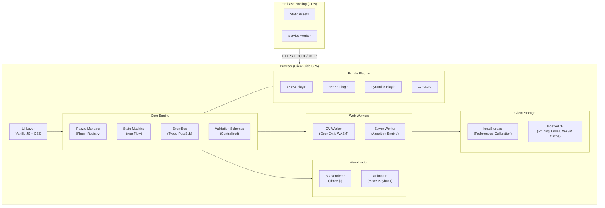

### 2.2 Plugin Architecture (Core Extensibility Pattern)

Every puzzle type implements a **standard plugin interface**. The core engine is completely puzzle-agnostic.

**Plugin API Version**: `PLUGIN_API_VERSION = 1`

Plugins must declare their required API version. The registry will reject plugins that require a version higher than the current core supports. This enables graceful forward-compatibility when the interface evolves for non-cubic geometries.

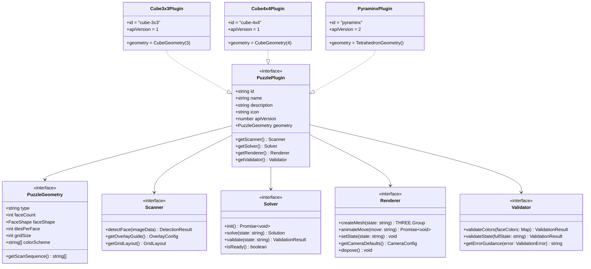

### 2.3 Key Abstraction: `PuzzleGeometry`

This is the critical abstraction that enables multi-geometry support:

```javascript
// Geometry types and their properties
const GEOMETRIES = {
  cube: {
    type: 'cube',
    faceShape: 'square',        // square, triangle, pentagon
    faceCount: 6,
    faceLayout: 'cross',        // unfolded layout pattern
    scanAngles: [0, 90, 180, 270, -90, 90],  // camera guidance
  },
  tetrahedron: {
    type: 'tetrahedron',
    faceShape: 'triangle',
    faceCount: 4,
    faceLayout: 'triangle-strip',
    scanAngles: [0, 120, 240, -60],
  },
  dodecahedron: {
    type: 'dodecahedron',
    faceShape: 'pentagon',
    faceCount: 12,
    faceLayout: 'net',
    scanAngles: [/* 12 angles */],
  },
};
```

The CV pipeline adapts based on geometry:
- **Square faces** → 4-sided polygon detection, N×N grid clustering
- **Triangle faces** → 3-sided polygon detection, triangular grid
- **Pentagon faces** → 5-sided polygon detection, radial segmentation

---

## 3. Component Architecture

### 3.1 Module Dependency Graph

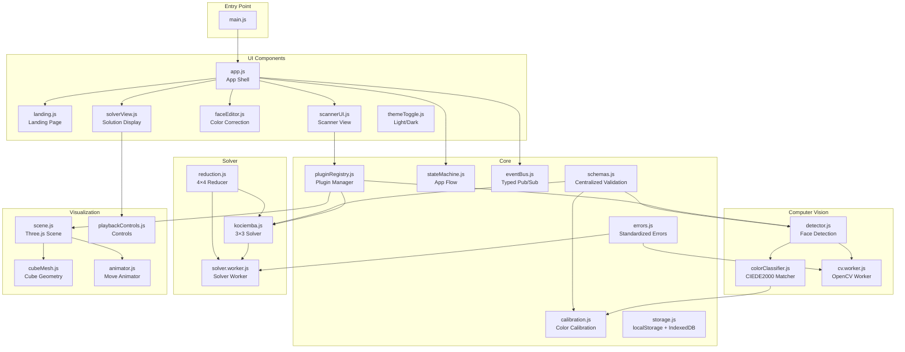

### 3.2 Application State Machine

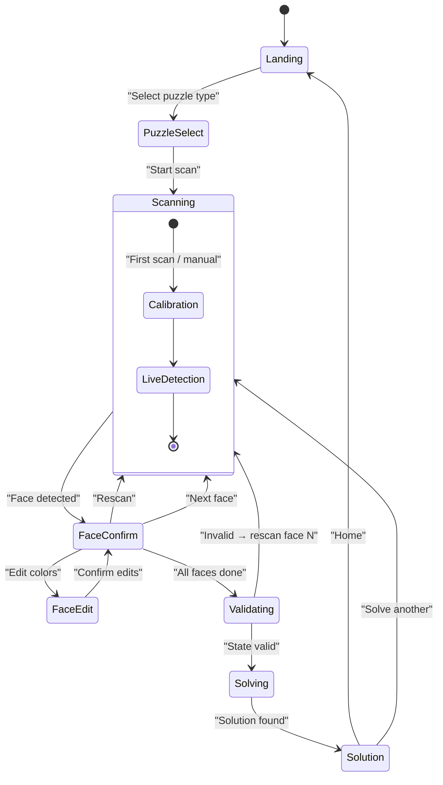

### 3.3 EventBus — Typed Event Catalog

Following the proven pattern from Breadato's `TypedEventEmitter`, all inter-module communication flows through a singleton `eventBus`. This decouples emitters from consumers and enables clean lifecycle management.

#### Event Catalog

| Event | Emitter | Consumer(s) | Payload | Description |
|---|---|---|---|---|
| `cv:init-progress` | CV Worker | Scanner UI, App Shell | `{ percent: number, stage: string }` | OpenCV.js download/init progress |
| `cv:init-complete` | CV Worker | Scanner UI, App Shell | `void` | OpenCV.js ready |
| `cv:face-detected` | CV Worker | Scanner UI | `DetectionResult` | Face grid found and colors extracted |
| `cv:lighting-warning` | CV Worker | Scanner UI | `LightingAssessment` | Poor lighting conditions detected |
| `solver:init-progress` | Solver Worker | App Shell | `{ percent: number }` | Pruning table generation progress |
| `solver:ready` | Solver Worker | App Shell | `void` | Solver initialized and ready |
| `solver:solution` | Solver Worker | Solution View | `Solution` | Solve completed |
| `solver:error` | Solver Worker | App Shell | `AppError` | Solve failed |
| `state:face-scanned` | Scanner UI | State Builder | `{ faceLabel: string, colors: string[][] }` | One face confirmed by user |
| `state:face-edited` | Face Editor | State Builder | `{ faceLabel: string, colors: string[][] }` | User manually corrected a face |
| `state:all-faces-complete` | State Builder | Validator | `{ state: string }` | All 6 faces collected |
| `state:validation-pass` | Validator | Solver Worker, Solution View | `{ state: string }` | State is valid and solvable |
| `state:validation-fail` | Validator | Scanner UI | `ValidationError` | State is invalid |
| `viz:move-started` | Animator | Solution View | `{ moveIndex: number, move: string }` | Animation of a move started |
| `viz:move-completed` | Animator | Solution View | `{ moveIndex: number }` | Animation of a move finished |
| `viz:playback-complete` | Animator | Solution View | `void` | All moves animated |
| `ui:theme-changed` | Theme Toggle | All | `'light' \| 'dark'` | Theme preference changed |
| `ui:navigate` | Any | App Shell | `{ view: string, params?: object }` | View transition request |

#### Lifecycle Management

```javascript
// Subscribe (in component init)
const unsub = eventBus.on('cv:face-detected', handleDetection);

// Unsubscribe (in component destroy)
unsub();  // prevents memory leaks and duplicate handlers
```

All `on()` calls return an unsubscribe function. Components **must** call it during cleanup to prevent memory leaks — matching the `useEffect` cleanup pattern from Breadato's React integration.

---

## 4. Computer Vision Architecture

### 4.1 Detection Pipeline

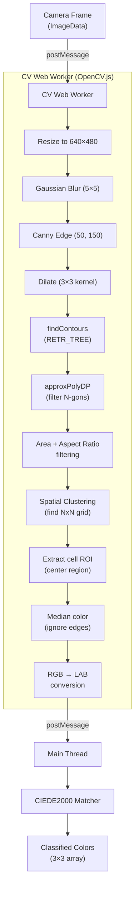

### 4.2 Color Calibration System — Deep Dive

The calibration system is the linchpin of scan accuracy. It mitigates the #1 failure mode: variable lighting.

#### Why Center Squares?

On any standard Rubik's Cube, **center squares are fixed** — they never move relative to each other. The center tile defines the color of that face. This gives us **6 guaranteed reference points**.

#### Calibration Modes

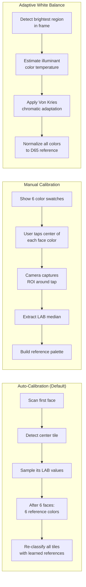

#### Calibration Data Flow

```javascript
// CalibrationProfile — stored in localStorage, validated by schemas.js
{
  version: 1,
  timestamp: "2026-04-26T20:00:00Z",
  illuminant: { L: 95.2, a: -1.3, b: 2.8 },  // estimated light color
  references: {
    white:  { L: 93.1, a: -0.5, b:  2.1 },
    yellow: { L: 87.4, a: -5.2, b: 80.3 },
    red:    { L: 42.8, a: 55.1, b: 30.7 },
    orange: { L: 62.1, a: 38.4, b: 60.2 },
    blue:   { L: 31.5, a: 12.3, b: -52.1 },
    green:  { L: 48.7, a: -40.2, b: 25.8 },
  },
  thresholds: {
    maxDelta: 25.0,        // max CIEDE2000 distance for a valid match
    ambiguityGap: 5.0,     // min gap between best and second-best match
  }
}
```

#### CIEDE2000 Decision Logic

For each detected tile:
1. Compute CIEDE2000 distance to all 6 reference colors
2. Sort distances ascending → `[best, second, ...]`
3. Decision rules:
   - `best.delta < threshold.maxDelta` AND `second.delta - best.delta > threshold.ambiguityGap` → **confident match**
   - `best.delta < threshold.maxDelta` AND gap is small → **uncertain match** (highlight in UI for manual review)
   - `best.delta > threshold.maxDelta` → **no match** (flag error, suggest recalibration)

#### Lighting Warning System

```javascript
// Pre-scan lighting quality check
function assessLightingQuality(frame) {
  const gray = cvtColor(frame, COLOR_BGR2GRAY);
  const mean = meanStdDev(gray);
  
  return {
    brightness: mean.mean,      // < 60 = too dark, > 220 = blown out
    contrast: mean.stddev,      // < 20 = too flat (overcast/shadow)
    colorCast: detectColorCast(frame),  // dominant hue shift from neutral
    recommendation: getRecommendation(mean),
  };
}
```

---

## 5. Solver Architecture

### 5.1 Solver Strategy by Puzzle Type

| Puzzle | Algorithm | Optimality | Approach |
|---|---|---|---|
| **3×3×3** | Kociemba Two-Phase | ≤ 20 moves (God's Number) | Direct solve via pruning tables |
| **4×4×4** | Reduction → Kociemba | ~40–60 moves | Reduce to 3×3 state, then Kociemba |
| **2×2×2** | Optimal (BFS/IDA*) | ≤ 11 moves | Small state space allows exhaustive search |
| **Pyraminx** | Layer-by-layer / Optimal | ≤ 11 moves | Small state space, tips trivially oriented |
| **Megaminx** | Layer-by-layer heuristic | ~100+ moves | Complex; heuristic approach |

### 5.2 Solver Worker Architecture

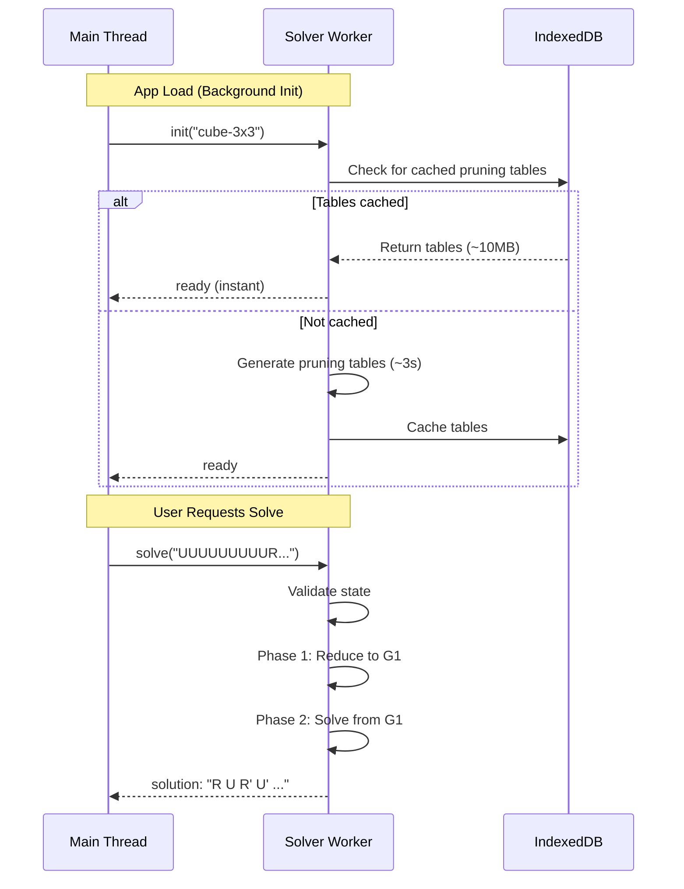

### 5.3 4×4×4 Reduction Pipeline (Future)

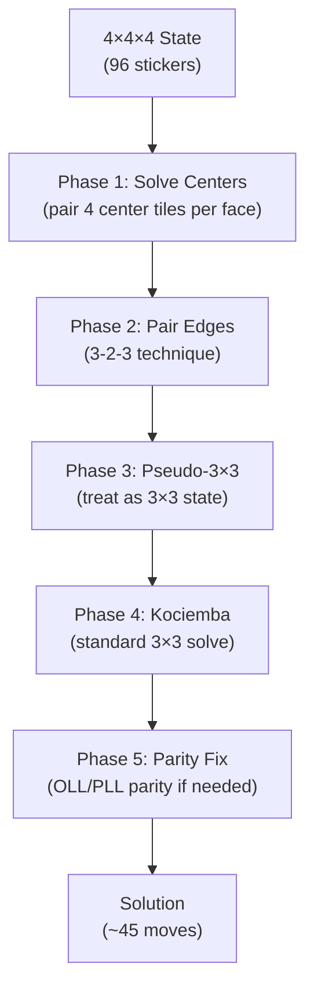

---

## 6. Rendering Architecture

### 6.1 Three.js Scene Graph

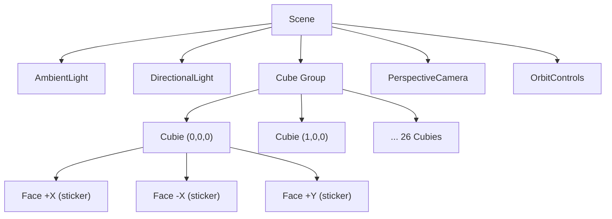

For a 3×3, there are **26 visible cubies** (no center piece), each with 1–3 colored sticker faces + black body.

### 6.2 Animation System

```javascript
// Move animation contract (per puzzle plugin)
class MoveAnimator {
  // Given a move token (e.g., "R", "U'", "2R" for 4×4),
  // returns the set of cubies to rotate and the rotation axis/angle
  getMoveTransform(move) {
    return {
      cubieIndices: [/* affected cubie indices */],
      axis: new THREE.Vector3(1, 0, 0),  // rotation axis
      angle: Math.PI / 2,                 // 90° for quarter turn
      duration: 400,                       // ms
    };
  }
}
```

### 6.3 Memory Management

Three.js resources **must be explicitly disposed** to prevent GPU memory leaks. Each Renderer plugin must implement a `dispose()` method that:

1. Traverses the scene graph and disposes all geometries, materials, and textures
2. Removes all event listeners from OrbitControls
3. Disposes the WebGLRenderer
4. Nullifies all Three.js references

```javascript
dispose() {
  // 1. Traverse and dispose
  this.group.traverse((child) => {
    if (child.geometry) child.geometry.dispose();
    if (child.material) {
      if (Array.isArray(child.material)) {
        child.material.forEach(m => m.dispose());
      } else {
        child.material.dispose();
      }
    }
  });
  
  // 2. Clean up controls
  this.controls.dispose();
  
  // 3. Dispose renderer
  this.renderer.dispose();
  this.renderer.forceContextLoss();
  
  // 4. Nullify references
  this.scene = null;
  this.camera = null;
  this.renderer = null;
}
```

This is called when:
- User navigates away from the Solution view
- A new puzzle type is selected (old renderer disposed, new one created)
- The component is destroyed

---

## 7. Data Flow Architecture

### 7.1 End-to-End Data Flow

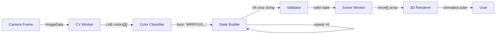

### 7.2 Centralized Validation (`schemas.js`)

Following the AI Governance HQ pattern of consolidating all validation into a single module, `src/core/schemas.js` exports validators for every data shape that crosses a module boundary:

```javascript
// src/core/schemas.js — single source of truth for all data shapes
export const CalibrationProfileSchema = { /* ... */ };
export const DetectionResultSchema = { /* ... */ };
export const CubeStateSchema = { /* ... */ };
export const SolutionSchema = { /* ... */ };
export const LightingAssessmentSchema = { /* ... */ };
export const ValidationResultSchema = { /* ... */ };
export const OverlayConfigSchema = { /* ... */ };
```

All data entering or leaving a Web Worker is validated against these schemas. This prevents silent data corruption from broken `postMessage` serialization and makes debugging straightforward.

### 7.3 Storage Strategy

| Store | Contents | Max Size |
|---|---|---|
| **localStorage** | Theme preference, calibration profile, last puzzle type | < 10KB |
| **IndexedDB** | Kociemba pruning tables (3×3), future solver tables | ~10–50MB |
| **Service Worker Cache** | App shell, OpenCV.js WASM, Three.js | ~15MB |

---

## 8. Deployment Architecture

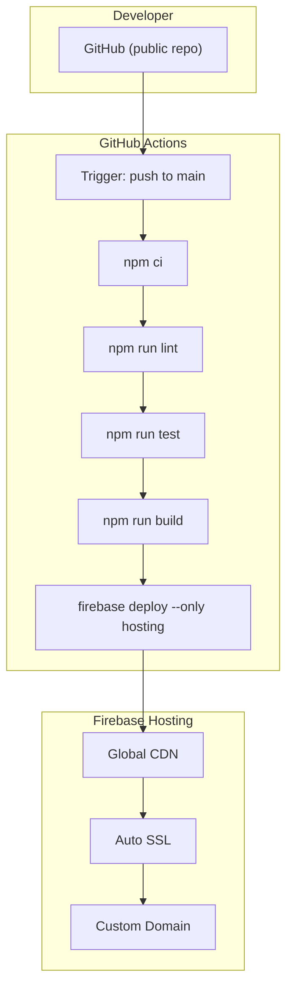

### Firebase Configuration

```json
{
  "hosting": {
    "public": "dist",
    "ignore": ["firebase.json", "**/.*", "**/node_modules/**"],
    "rewrites": [
      { "source": "**", "destination": "/index.html" }
    ],
    "headers": [
      {
        "source": "**/*.wasm",
        "headers": [{ "key": "Content-Type", "value": "application/wasm" }]
      },
      {
        "source": "**",
        "headers": [
          { "key": "Cross-Origin-Opener-Policy", "value": "same-origin" },
          { "key": "Cross-Origin-Embedder-Policy", "value": "require-corp" }
        ]
      }
    ]
  }
}
```

> **Note on COOP/COEP (ref: AP-6):** These headers are mandatory for `SharedArrayBuffer` support, which OpenCV.js WASM threading potentially uses. Consequence: all external resources (Google Fonts, CDN scripts) must include `crossorigin` attribute or be self-hosted. Firebase Hosting supports custom headers natively.

---

## 9. Project Structure

```
magic-cube/
├── public/
│   ├── index.html
│   ├── favicon.svg
│   └── assets/
│       └── icons/
├── src/
│   ├── main.js                         # Entry point
│   ├── styles/
│   │   ├── tokens.css                  # Design tokens (CSS custom properties)
│   │   ├── base.css                    # Reset + typography
│   │   ├── layout.css                  # App shell layout
│   │   ├── scanner.css                 # Scanner view styles
│   │   ├── editor.css                  # Face editor styles
│   │   ├── solver.css                  # Solution view styles
│   │   └── viewer.css                  # 3D viewer styles
│   ├── core/
│   │   ├── pluginRegistry.js           # Puzzle plugin manager (version-checked)
│   │   ├── stateMachine.js             # App flow state machine
│   │   ├── eventBus.js                 # Typed pub/sub (see §3.3)
│   │   ├── schemas.js                  # Centralized validation (see §7.2)
│   │   ├── errors.js                   # Standardized error objects
│   │   └── storage.js                  # localStorage / IndexedDB helpers
│   ├── cv/
│   │   ├── cv.worker.js                # OpenCV Web Worker
│   │   ├── detector.js                 # Contour detection pipeline
│   │   ├── colorClassifier.js          # CIEDE2000 matching engine
│   │   ├── calibration.js              # Calibration system
│   │   └── ciede2000.js                # CIEDE2000 ΔE calculation
│   ├── plugins/
│   │   ├── cube3x3/
│   │   │   ├── index.js                # Plugin registration (apiVersion: 1)
│   │   │   ├── geometry.js             # 3×3 cube geometry definition
│   │   │   ├── scanner.js              # 3×3 face detection config
│   │   │   ├── solver.js               # Kociemba wrapper
│   │   │   ├── renderer.js             # 3×3 Three.js mesh + dispose()
│   │   │   └── validator.js            # State validation
│   │   ├── cube4x4/                    # (Future v2.0) Same structure
│   │   └── pyraminx/                   # (Future v3.0) Same structure
│   ├── viz/
│   │   ├── scene.js                    # Three.js scene setup + disposal
│   │   ├── animator.js                 # Move animation engine
│   │   └── playbackControls.js         # Play/pause/step UI
│   └── ui/
│       ├── app.js                      # App shell + router
│       ├── landing.js                  # Landing page
│       ├── scannerView.js              # Scanner UI (camera + overlay)
│       ├── faceEditor.js               # Manual color correction
│       ├── solutionView.js             # Solution display
│       ├── puzzleSelector.js           # Puzzle type picker
│       └── themeToggle.js              # Light/dark switch
├── tests/
│   ├── cv/
│   │   ├── colorClassifier.test.js
│   │   └── ciede2000.test.js
│   ├── plugins/
│   │   └── cube3x3/
│   │       ├── solver.test.js
│   │       └── validator.test.js
│   └── core/
│       ├── stateMachine.test.js
│       ├── schemas.test.js
│       └── eventBus.test.js
├── tests/fixtures/                     # CV test images (see SDLC §4.3)
├── firebase.json
├── .firebaserc
├── .github/
│   └── workflows/
│       └── deploy.yml
├── package.json
├── vite.config.js
└── README.md
```

> Note: Workers live **inside `src/`** (e.g., `src/cv/cv.worker.js`). Vite handles bundling workers via `new Worker(new URL('./cv.worker.js', import.meta.url))`. There is no separate top-level `workers/` directory.

---

## 10. Architecture Decision Records (ADRs)

### ADR-001: Vanilla JS over React/Vue/Svelte
- **Context**: A framework would add complexity and bundle size for an app with ~7 views.
- **Decision**: Vanilla JS with a lightweight state machine and EventBus.
- **Rationale**: Minimal bundle (~0KB framework overhead), no build-time framework lock-in, full control over rendering lifecycle. The app's complexity is in the algorithms (CV, solver), not in the UI component tree.
- **Trade-off**: More boilerplate for DOM updates. Acceptable given the app's focused scope.

### ADR-002: OpenCV.js (WASM) over TensorFlow.js
- **Context**: Need client-side image processing for contour detection and color extraction.
- **Decision**: OpenCV.js loaded as WASM.
- **Rationale**: No ML model training needed. Classical CV (Canny, findContours) is deterministic and well-understood. TF.js would require a trained model, adding complexity and an ML dependency that violates the "no AI" requirement.
- **Trade-off**: OpenCV.js is ~8MB. Mitigated by lazy-loading and Service Worker caching.

### ADR-003: cubejs (npm) over custom IDA* solver
- **Context**: Need a near-optimal 3×3 solver running in JavaScript.
- **Decision**: Use the `cubejs` package (Kociemba Two-Phase in pure JS).
- **Rationale**: Well-tested, MIT licensed, ≤20 moves guaranteed, runs in Web Worker. Building a custom solver would take weeks and yield no better results.
- **Trade-off**: Dependency on a third-party package. Mitigated: package is self-contained and can be forked/vendored if unmaintained.

### ADR-004: Three.js over CSS 3D / Babylon.js
- **Context**: Need animated 3D cube visualization.
- **Decision**: Three.js with ES module tree-shaking.
- **Rationale**: Industry standard, smallest viable import (~50KB tree-shaken), excellent documentation, well-supported OrbitControls.
- **Trade-off**: Requires WebGL. Fallback: display solution in text notation only if WebGL unavailable.

### ADR-005: Firebase Hosting over Vercel/Netlify/GitHub Pages
- **Context**: Need static hosting with custom headers (COOP/COEP).
- **Decision**: Firebase Hosting on the existing GCP project.
- **Rationale**: Supports custom response headers per path (required for COOP/COEP), custom domain, preview channels for PRs, and is already configured in the user's GCP project.
- **Trade-off**: Requires Firebase CLI setup. GitHub Pages cannot set custom response headers.

### ADR-006: COOP/COEP headers as mandatory constraint
- **Context**: OpenCV.js WASM may use `SharedArrayBuffer` for multi-threaded operation, which requires cross-origin isolation.
- **Decision**: Ship COOP/COEP headers on all responses.
- **Rationale**: Enables maximum WASM performance. Also enforced by browser security requirements.
- **Trade-off**: Cross-origin resources (Google Fonts, CDN scripts) must include `crossorigin` attribute or be self-hosted. Potential impact on third-party embeds.

### ADR-007: Content Security Policy — `wasm-unsafe-eval` required
- **Context**: OpenCV.js WASM needs to compile WebAssembly modules at runtime. Standard CSP `script-src` blocks this.
- **Decision**: Use `script-src 'self' 'wasm-unsafe-eval'` in CSP. **Not** full `unsafe-eval`.
- **Rationale**: `wasm-unsafe-eval` (supported since Chrome 97, Firefox 102, Safari 16) permits WASM compilation without opening the full `eval()` surface. This is the recommended practice per W3C WebAssembly CSP specification.
- **Trade-off**: Older browsers that don't support `wasm-unsafe-eval` will fall back to `unsafe-eval` or no CSP enforcement. Acceptable for our browser support matrix.

---

## 11. Technology Decisions

| Decision | Choice | Alternatives Considered | Rationale |
|---|---|---|---|
| **Build Tool** | Vite | Webpack, Parcel, esbuild | Best DX, fast HMR, native ESM, small output |
| **Framework** | Vanilla JS | React, Vue, Svelte | Minimal bundle, no framework overhead (ADR-001) |
| **CV Engine** | OpenCV.js (WASM) | TensorFlow.js, custom CV | Deterministic, no ML dependency (ADR-002) |
| **3×3 Solver** | cubejs (Two-Phase) | min2phase, custom IDA* | Pure JS, well-maintained, optimal (ADR-003) |
| **3D Renderer** | Three.js | Babylon.js, CSS 3D, p5.js | Industry standard, tree-shakeable (ADR-004) |
| **Hosting** | Firebase Hosting | Vercel, Netlify, GitHub Pages | Custom headers for COOP/COEP (ADR-005) |
| **CI/CD** | GitHub Actions | CircleCI, Cloud Build | Native GitHub integration, free for public repos |
