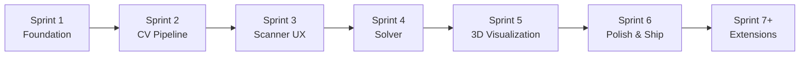
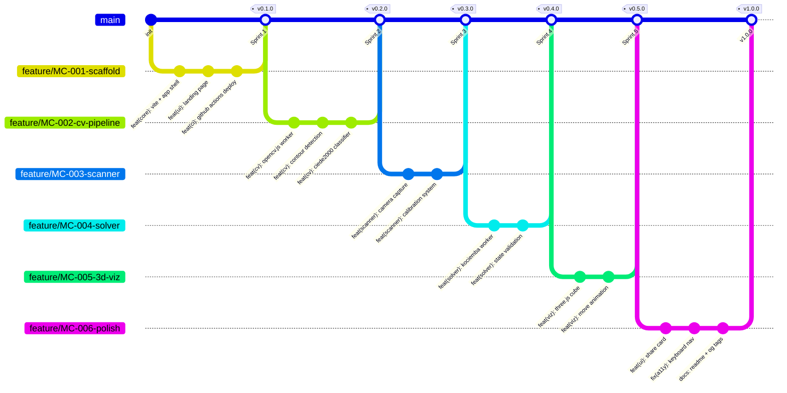
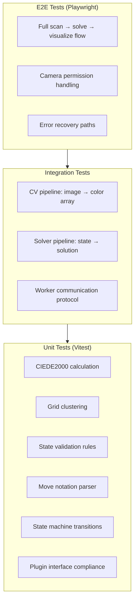

# SDLC — Magic Cube Solver Development Lifecycle

> **Version**: 1.0  
> **Status**: Draft  
> **Date**: 2026-04-26  
> **Relates to**: [PRD.md](file:///c:/Users/alexander.herttrich/Antigravity%20Workspaces/Magic%20Cube/docs/PRD.md) · [ARCH.md](file:///c:/Users/alexander.herttrich/Antigravity%20Workspaces/Magic%20Cube/docs/ARCH.md) · [SPEC.md](file:///c:/Users/alexander.herttrich/Antigravity%20Workspaces/Magic%20Cube/docs/SPEC.md)

---

## 1. Development Methodology

**Iterative Feature Sprints** — each sprint delivers a shippable increment. No sprint exceeds 1 session of focused work.



---

## 2. Sprint Plan

### Sprint 1: Foundation & Project Scaffold

**Goal**: Deployable app shell on Firebase with CI/CD pipeline

| Task | Description | Acceptance Criteria |
|---|---|---|
| S1.1 | Initialize Vite project with vanilla JS | `npm run dev` serves landing page |
| S1.2 | Configure design tokens (CSS custom properties) | All tokens from SPEC §5.1 defined |
| S1.3 | Build app shell (header, main, theme toggle) | Light/dark theme working |
| S1.4 | Create landing page with hero animation | 3D cube (static preview) renders |
| S1.5 | Set up Firebase Hosting config | `firebase.json` with COOP/COEP headers |
| S1.6 | Set up GitHub repo (public) | README, LICENSE, .gitignore |
| S1.7 | Set up GitHub Actions → Firebase deploy | Push to `main` auto-deploys |
| S1.8 | Set up plugin registry (empty) | `pluginRegistry.js` with register/get API |
| S1.9 | Set up state machine (app flow) | States from ARCH §3.2 defined |
| S1.10 | Set up event bus | Pub/sub working between modules |

**Deliverable**: Live URL on Firebase with landing page

---

### Sprint 2: Computer Vision Pipeline

**Goal**: OpenCV.js loads, detects a 3×3 grid, and classifies colors

| Task | Description | Acceptance Criteria |
|---|---|---|
| S2.1 | OpenCV.js lazy loading with progress UI | Load bar shows %, cached after first load |
| S2.2 | CV Web Worker setup | Worker initializes OpenCV.js off-main-thread |
| S2.3 | Image pre-processing pipeline | Blur → Canny → Dilate in worker |
| S2.4 | Contour detection & polygon filtering | Detects 4-sided polygons in test images |
| S2.5 | Grid clustering algorithm | Correctly identifies 3×3 grid from 9 squares |
| S2.6 | Color extraction (cell center ROI) | Extracts median LAB per cell |
| S2.7 | CIEDE2000 implementation | Unit tests pass against known ΔE values |
| S2.8 | Color classifier with default references | Classifies 6 colors under daylight |
| S2.9 | Test with 10+ reference images | ≥ 80% accuracy on test set |

**Deliverable**: Given an image of a cube face, returns a 3×3 color array

---

### Sprint 3: Scanner UX & Calibration

**Goal**: Live camera scanning with guided face sequence and calibration

| Task | Description | Acceptance Criteria |
|---|---|---|
| S3.1 | Camera access (`getUserMedia`, rear preference) | Camera activates on mobile + desktop |
| S3.2 | Video feed with grid overlay | 3×3 guide overlaid on live camera |
| S3.3 | Real-time detection loop | Colors update live as user moves cube |
| S3.4 | Face confirm/rescan UI | User can confirm or retry each face |
| S3.5 | Guided face sequence (6-step) | Prompts correct sequence with instructions |
| S3.6 | Manual face editor (color correction) | Tap tile → cycle through 6 colors |
| S3.7 | Auto-calibration (center square detection) | Center tile sampled per face as reference |
| S3.8 | Manual calibration flow | User taps 6 color targets to set references |
| S3.9 | Adaptive white balance | Von Kries adaptation applied |
| S3.10 | Lighting quality assessment & warnings | Warning shown if too dark / color cast |
| S3.11 | Calibration persistence (localStorage) | Profile survives page reload |
| S3.12 | Unfolded cube preview (all 6 faces) | Shows running result as faces are scanned |

**Deliverable**: User can scan all 6 faces and see a validated color map

---

### Sprint 4: Solver Integration

**Goal**: Valid cube state → optimal solution in < 2s

| Task | Description | Acceptance Criteria |
|---|---|---|
| S4.1 | Cube state builder (6 faces → 54-char string) | Correct Kociemba notation output |
| S4.2 | State validation (all rules from SPEC §3.2) | Catches invalid states with specific errors |
| S4.3 | Solver Worker setup | `cubejs` runs in Web Worker |
| S4.4 | Pruning table generation + IndexedDB caching | First load < 5s, subsequent < 100ms |
| S4.5 | Solve API: state in → moves out | Verified against known scrambles |
| S4.6 | Error handling (invalid state, timeout) | User-friendly error messages |
| S4.7 | Move count + optimality stats | Shows moves vs. God's Number |
| S4.8 | Validation → error routing back to scanner | "Rescan face X" with diagnostic |

**Deliverable**: End-to-end: scanned state → validated → solved → moves displayed

---

### Sprint 5: 3D Visualization

**Goal**: Interactive 3D cube with step-by-step animated solution playback

| Task | Description | Acceptance Criteria |
|---|---|---|
| S5.1 | Three.js scene setup (camera, lights, controls) | Orbit controls, responsive canvas |
| S5.2 | 3×3 cube mesh generation (26 cubies) | Correct face colors from state |
| S5.3 | Single move animation (face rotation) | Smooth 90° rotation of affected cubies |
| S5.4 | Playback controller (play/pause/step/reset) | All controls work correctly |
| S5.5 | Speed control slider | 0.5x → 3x speed |
| S5.6 | Move notation list with current highlight | Active move highlighted during playback |
| S5.7 | Initial state → solved state animation | Full solution playback from start |
| S5.8 | Step backward support | Can rewind one move at a time |

**Deliverable**: Full animated 3D solution playback

---

### Sprint 6: Polish, Share & Ship v1.0

**Goal**: Production-ready, polished application

| Task | Description | Acceptance Criteria |
|---|---|---|
| S6.1 | Solution share card (image generation) | Downloadable image with cube + solution |
| S6.2 | Responsive layout audit (mobile/tablet/desktop) | All views work across breakpoints |
| S6.3 | Error boundary & fallback UI | Graceful degradation for WebGL fails etc. |
| S6.4 | Loading states & skeletons | Every async operation has visual feedback |
| S6.5 | Accessibility audit (keyboard, focus, ARIA) | Keyboard navigation through all flows |
| S6.6 | Performance audit (Lighthouse) | Score ≥ 90 on Performance, A11y, Best Practices |
| S6.7 | Custom domain setup | Custom domain live and working |
| S6.8 | README with screenshots + usage guide | Clear documentation for GitHub |
| S6.9 | Open Graph / SEO meta tags | Rich preview when shared on social |
| S6.10 | Final cross-browser testing | Chrome, Safari, Firefox, Edge |

**Deliverable**: v1.0 live, publicly accessible, polished

---

### Sprint 7+: Extensions (Future)

| Sprint | Goal | Key Work |
|---|---|---|
| **7** | 4×4×4 Support | 4×4 grid detection, reduction solver, parity handling, 4×4 mesh |
| **8** | 2×2×2 Support | Simpler scanner, optimal BFS solver, 2×2 mesh |
| **9** | Pyraminx Support | Triangle face detection, tetrahedron solver, pyramid mesh |
| **10** | Puzzle Hub | Puzzle selector UI, catalog page, unified landing |
| **11** | Megaminx Support | Pentagon detection, 12-face scanning, dodecahedron mesh |

---

## 3. Git Workflow

### Branch Strategy



### Commit Convention

```
feat(scope):   — New feature
fix(scope):    — Bug fix
refactor:      — Code restructure without behavior change
test:          — Adding/updating tests
docs:          — Documentation changes
ci:            — CI/CD changes
style:         — Formatting, whitespace (not CSS)
perf:          — Performance improvements
```

**Scopes**: `core`, `cv`, `scanner`, `solver`, `viz`, `ui`, `ci`, `docs`

### Branch Naming

```
feature/MC-<number>-<description>
fix/MC-<number>-<description>
```

---

## 4. Testing Strategy

### 4.1 Test Pyramid



### 4.2 Test Framework

| Layer | Tool | Purpose |
|---|---|---|
| **Unit** | Vitest | Fast, ESM-native, Vite-compatible |
| **Integration** | Vitest + jsdom | Worker communication, pipeline tests |
| **E2E** | Playwright | Full browser testing with camera mocking |
| **Visual** | Manual screenshots | UI review before each release |

### 4.3 CV Test Dataset

Maintain a `tests/fixtures/` directory with:

| Category | Count | Purpose |
|---|---|---|
| **Daylight** | 6 images | Baseline detection accuracy |
| **Indoor (warm)** | 6 images | Tungsten/LED lighting test |
| **Indoor (cool)** | 6 images | Fluorescent lighting test |
| **Low light** | 6 images | Error detection threshold |
| **Overexposed** | 6 images | Blown highlight handling |
| **Angled** | 6 images | Perspective distortion tolerance |

### 4.4 CI Pipeline

```yaml
# .github/workflows/deploy.yml
name: Deploy to Firebase

on:
  push:
    branches: [main]
  pull_request:
    branches: [main]

jobs:
  test:
    runs-on: ubuntu-latest
    steps:
      - uses: actions/checkout@v4
      - uses: actions/setup-node@v4
        with:
          node-version: 20
          cache: 'npm'
      - run: npm ci
      - run: npm run lint
      - run: npm run test
      - run: npm run build

  deploy:
    needs: test
    if: github.ref == 'refs/heads/main'
    runs-on: ubuntu-latest
    steps:
      - uses: actions/checkout@v4
      - uses: actions/setup-node@v4
        with:
          node-version: 20
          cache: 'npm'
      - run: npm ci
      - run: npm run build
      - uses: FirebaseExtended/action-hosting-deploy@v0
        with:
          repoToken: ${{ secrets.GITHUB_TOKEN }}
          firebaseServiceAccount: ${{ secrets.FIREBASE_SERVICE_ACCOUNT }}
          channelId: live
          projectId: tenacious-tiger-473819-p9
```

---

## 5. Quality Gates

### Per-Sprint Gates

| Gate | Tool | Threshold |
|---|---|---|
| **Lint** | ESLint | Zero errors |
| **Unit Tests** | Vitest | 100% pass |
| **Build** | Vite | Zero errors |
| **Bundle Size** | Vite build stats | < 150KB gzipped (core) |
| **Lighthouse** | Lighthouse CI | ≥ 90 (Perf, A11y, BP) |

### Pre-Release Gates (v1.0)

| Gate | Description | Owner |
|---|---|---|
| **Cross-browser** | Tested on Chrome, Safari, Firefox, Edge | Manual |
| **Mobile** | Tested on iOS Safari + Android Chrome | Manual |
| **Camera** | Camera scanning works on ≥ 3 devices | Manual |
| **CV Accuracy** | ≥ 85% face detection rate on test dataset | Automated |
| **Solver** | 100% solve rate on 100 random scrambles | Automated |
| **Performance** | Meets all budgets from SPEC §8 | Automated |
| **Security** | `npm audit` shows zero high/critical | Automated |

---

## 6. Release Strategy

### Versioning

**Semantic Versioning** (SemVer):
- `0.x.0` — Pre-release sprints
- `1.0.0` — First public release (3×3×3 only)
- `2.0.0` — 4×4×4 support (breaking: new plugin API if needed)
- `3.0.0` — Non-cubic geometries

### Release Cadence

| Phase | Cadence | Channel |
|---|---|---|
| **Development** | Per-sprint | Firebase preview channels |
| **Stable** | Per milestone | Firebase live channel |
| **Hotfix** | As needed | Firebase live channel |

### Preview Channels

For Pull Requests, Firebase Hosting creates preview URLs automatically:
```
https://<project>--<pr-number>-<hash>.web.app
```

---

## 7. Monitoring & Observability

Since this is a fully client-side app with zero backend, traditional monitoring doesn't apply. However:

| Signal | Method | Rationale |
|---|---|---|
| **Errors** | `window.onerror` + console logging | Debug issues from user reports |
| **Performance** | `PerformanceObserver` (LCP, FID, CLS) | Track Core Web Vitals |
| **Bundle** | Lighthouse CI in GitHub Actions | Catch size regressions |
| **Uptime** | Firebase Hosting SLA (99.95%) | CDN-backed reliability |

> [!NOTE]
> No analytics / tracking is deployed. This is a privacy-first application. Users can inspect network traffic to verify zero outbound data.

---

## 8. Documentation Deliverables

| Document | Location | Updated When |
|---|---|---|
| **PRD** | `docs/PRD.md` | Requirements change |
| **ARCH** | `docs/ARCH.md` | Architecture decisions change |
| **SPEC** | `docs/SPEC.md` | Interface contracts change |
| **SDLC** | `docs/SDLC.md` | Process changes |
| **README** | `README.md` | Every sprint |
| **CHANGELOG** | `CHANGELOG.md` | Every release |
| **API (inline)** | JSDoc in source files | With code changes |

---

## 9. Risk Register

| # | Risk | Probability | Impact | Mitigation | Owner |
|---|---|---|---|---|---|
| R1 | OpenCV.js WASM fails on some browsers | Medium | High | Feature-detect WASM; fallback to non-WASM build | Sprint 2 |
| R2 | Color detection unreliable in poor lighting | High | High | Calibration system + manual correction + lighting warnings | Sprint 3 |
| R3 | SharedArrayBuffer blocked (missing COOP/COEP) | Low | Medium | Firebase custom headers; fallback to single-thread | Sprint 1 |
| R4 | `cubejs` package unmaintained/broken | Low | High | Fork + vendor; package is self-contained | Sprint 4 |
| R5 | Three.js bundle too large | Medium | Medium | Tree-shake imports; use minimal modules | Sprint 5 |
| R6 | Mobile camera quality too low for CV | Medium | Medium | Resolution hints; steady-shot guide; manual fallback | Sprint 3 |
| R7 | 4×4×4 solver complexity exceeds browser capability | Medium | Medium | WASM solver; longer timeout; progress UI | Sprint 7 |
| R8 | Custom domain DNS propagation delays | Low | Low | Use `.web.app` fallback until propagated | Sprint 6 |

---

## 10. Definition of Done

A task is **done** when:

- [ ] Code is committed with conventional commit message
- [ ] All existing tests pass
- [ ] New code has appropriate test coverage
- [ ] Code passes ESLint with zero errors
- [ ] Bundle size is within budget
- [ ] Feature works on Chrome + Safari mobile
- [ ] PR is approved and squash-merged to `main`
- [ ] Deployment pipeline succeeds
- [ ] Sprint deliverable is verifiable on live URL
