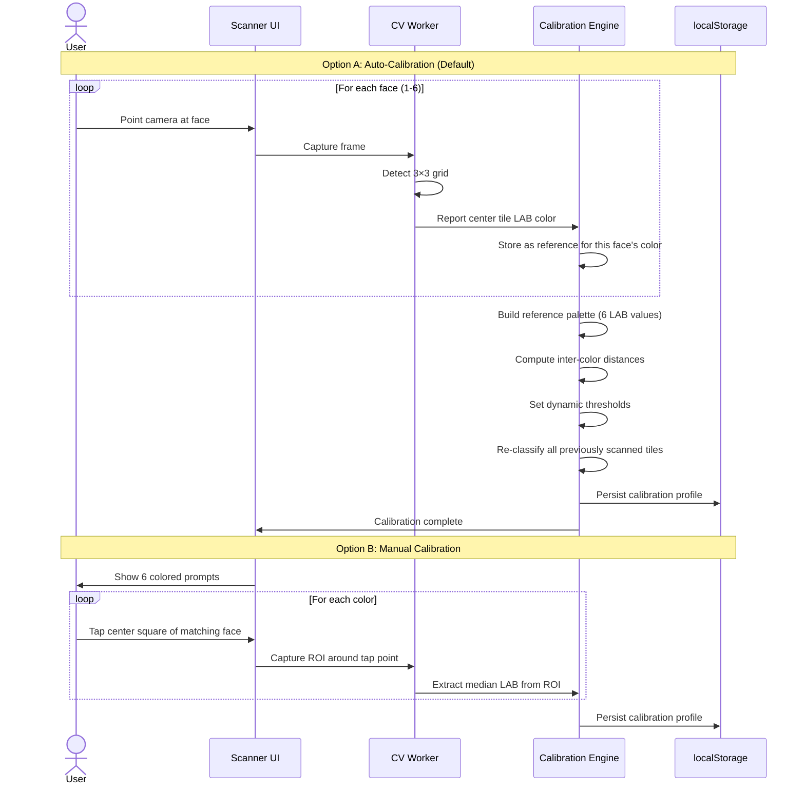

# SPEC — Magic Cube Solver Technical Specification

> **Version**: 1.0  
> **Status**: Draft  
> **Date**: 2026-04-26  
> **Relates to**: [PRD.md](file:///c:/Users/alexander.herttrich/Antigravity%20Workspaces/Magic%20Cube/docs/PRD.md) · [ARCH.md](file:///c:/Users/alexander.herttrich/Antigravity%20Workspaces/Magic%20Cube/docs/ARCH.md)

---

## 1. Plugin Interface Specification

### 1.1 `PuzzlePlugin` Interface

Every puzzle type must implement all members of this interface to be registered in the plugin system.

```javascript
/**
 * @typedef {Object} PuzzlePlugin
 * @property {string} id           - Unique identifier (e.g., "cube-3x3")
 * @property {string} name         - Display name (e.g., "3×3×3 Rubik's Cube")
 * @property {string} description  - One-line description
 * @property {string} icon         - SVG icon path or inline SVG
 * @property {PuzzleGeometry} geometry
 * @property {function(): Scanner} getScanner
 * @property {function(): Solver} getSolver
 * @property {function(): Renderer} getRenderer
 * @property {function(): Validator} getValidator
 */
```

### 1.2 `PuzzleGeometry` Specification

```javascript
/**
 * @typedef {Object} PuzzleGeometry
 * @property {'cube'|'tetrahedron'|'dodecahedron'} type
 * @property {number} faceCount         - Total number of faces (6, 4, 12)
 * @property {'square'|'triangle'|'pentagon'} faceShape
 * @property {number} gridSize          - Tiles per grid dimension (3 for 3×3, 4 for 4×4)
 * @property {number} tilesPerFace      - Total tiles per face (gridSize² for cubes)
 * @property {number} totalTiles        - faceCount × tilesPerFace
 * @property {string[]} colorScheme     - Array of CSS color values for each face
 * @property {string[]} colorNames      - Human-readable color names
 * @property {string[]} faceLabels      - Face identifiers (e.g., ['U','R','F','D','L','B'])
 * @property {ScanSequence[]} scanSequence - Ordered face scanning instructions
 */

/**
 * @typedef {Object} ScanSequence
 * @property {string} faceLabel    - Which face to scan (e.g., "F")
 * @property {string} instruction  - User instruction (e.g., "Hold the cube with white center facing you")
 * @property {string} description  - Additional guidance
 * @property {number} rotationHint - Suggested rotation angle for camera guide
 */
```

### 1.3 `Scanner` Interface

```javascript
/**
 * @typedef {Object} Scanner
 * @property {function(ImageData, CalibrationProfile): Promise<DetectionResult>} detectFace
 * @property {function(): OverlayConfig} getOverlayGuide
 * @property {function(): GridLayout} getGridLayout
 */

/**
 * @typedef {Object} DetectionResult
 * @property {boolean} success          - Whether face was detected
 * @property {string[][]} colors        - NxN array of color names
 * @property {number[][]} confidence    - NxN array of confidence scores (0–1)
 * @property {Point[][]} gridPoints     - NxN array of detected tile center coordinates
 * @property {number} overallConfidence - Aggregate confidence (0–1)
 * @property {string[]} warnings        - Any concerns (e.g., "Low light detected")
 */

/**
 * @typedef {Object} OverlayConfig
 * @property {'grid'|'triangles'|'pentagons'} shape
 * @property {number} rows
 * @property {number} cols
 * @property {number} padding           - % of viewport
 * @property {string} strokeColor
 * @property {number} strokeWidth
 * @property {number} cornerRadius
 */
```

### 1.4 `Solver` Interface

```javascript
/**
 * @typedef {Object} Solver
 * @property {function(): Promise<void>} init          - Warm up / load tables
 * @property {function(): boolean} isReady              - Whether init is complete
 * @property {function(string): ValidationResult} validate - Check state validity
 * @property {function(string): Promise<Solution>} solve   - Compute solution
 */

/**
 * @typedef {Object} Solution
 * @property {string[]} moves           - Array of move tokens ["R", "U", "R'", "U'", ...]
 * @property {number} moveCount         - Total move count (HTM)
 * @property {number} solveTimeMs       - Computation time in milliseconds
 * @property {string} notation          - Formatted notation string "R U R' U' ..."
 * @property {Object} stats             - Additional stats
 * @property {number} stats.optimalMax  - Max optimal moves (God's Number for this puzzle)
 * @property {number} stats.efficiency  - moveCount / optimalMax as percentage
 */
```

### 1.5 `Renderer` Interface

```javascript
/**
 * @typedef {Object} Renderer
 * @property {function(string): THREE.Group} createMesh      - Build 3D mesh from state string
 * @property {function(string, Object): Promise<void>} animateMove  - Animate a single move
 * @property {function(string): void} setState               - Snap to state (no animation)
 * @property {function(): CameraConfig} getCameraDefaults     - Default camera position
 * @property {function(): void} dispose                       - Clean up Three.js resources
 */

/**
 * @typedef {Object} CameraConfig
 * @property {number[]} position  - [x, y, z]
 * @property {number[]} target    - Look-at target [x, y, z]
 * @property {number} fov         - Field of view in degrees
 * @property {number} near        - Near clipping plane
 * @property {number} far         - Far clipping plane
 */
```

### 1.6 `Validator` Interface

```javascript
/**
 * @typedef {Object} Validator
 * @property {function(Map<string, string[][]>): ValidationResult} validateColors
 * @property {function(string): ValidationResult} validateState
 * @property {function(ValidationError): string} getErrorGuidance
 */

/**
 * @typedef {Object} ValidationResult
 * @property {boolean} valid
 * @property {ValidationError[]} errors
 * @property {string[]} warnings
 */

/**
 * @typedef {Object} ValidationError
 * @property {'COLOR_COUNT'|'INVALID_PIECE'|'PARITY'|'ORIENTATION'} type
 * @property {string} message          - Human-readable error
 * @property {string} [affectedFace]   - Which face has the issue
 * @property {number[]} [affectedTiles] - Which tile indices are problematic
 */
```

---

## 2. Computer Vision Specification

### 2.1 OpenCV.js Loading

```javascript
// Lazy-load OpenCV.js with progress reporting
const OPENCV_CDN = 'https://docs.opencv.org/4.9.0/opencv.js';
const OPENCV_WASM_CDN = 'https://docs.opencv.org/4.9.0/opencv_js.wasm';

async function loadOpenCV(onProgress) {
  // 1. Check Service Worker cache first
  // 2. If not cached, fetch from CDN
  // 3. Report download progress via onProgress callback
  // 4. Initialize cv.onRuntimeInitialized
  // 5. Post-init: warm up by running a trivial operation
}
```

### 2.2 Contour Detection Parameters

| Parameter | Value | Rationale |
|---|---|---|
| Gaussian Blur kernel | 5×5 | Removes noise without losing tile edges |
| Canny low threshold | 50 | Catches faint edges in varied lighting |
| Canny high threshold | 150 | Suppresses noise artifacts |
| Dilation kernel | 3×3, 1 iteration | Closes small gaps in contour lines |
| Area min (% of image) | 0.5% | Filters tiny noise contours |
| Area max (% of image) | 15% | Filters contours larger than a single tile |
| Polygon epsilon | 0.04 × perimeter | Balance between accuracy and tolerance |
| Required vertices | 4 (square), 3 (triangle), 5 (pentagon) | Adapted by geometry plugin |
| Aspect ratio tolerance | 0.6–1.4 | Allows perspective distortion |

### 2.3 Grid Clustering Algorithm

For a detected set of N² candidate squares, determine if they form a valid grid:

```
1. Sort candidates by centroid Y (rows), then X (columns)
2. Use k-means (k = gridSize) on Y coordinates to identify rows
3. Within each row, sort by X coordinate
4. Validate:
   a. Each row has exactly gridSize tiles
   b. Row spacing is approximately equal
   c. Column spacing is approximately equal
   d. Overall arrangement forms a near-rectangular grid
5. If validation fails, relax constraints and retry
6. Return ordered NxN grid of tile centroids
```

### 2.4 CIEDE2000 Implementation

The CIEDE2000 (ΔE₀₀) formula computes perceptual color difference between two LAB colors:

```javascript
/**
 * Compute CIEDE2000 color difference
 * @param {Object} lab1 - {L, a, b} reference color
 * @param {Object} lab2 - {L, a, b} sample color
 * @returns {number} ΔE₀₀ value (0 = identical, >5 = clearly different)
 * 
 * Perceptual thresholds:
 *   ΔE < 1.0  — imperceptible difference
 *   ΔE 1–2    — barely perceptible
 *   ΔE 2–3.5  — noticeable on close inspection
 *   ΔE 3.5–5  — clearly noticeable
 *   ΔE > 5    — obvious, different color
 */
function ciede2000(lab1, lab2) {
  // Full CIEDE2000 formula implementation
  // Includes: lightness, chroma, hue weighting
  // Includes: rotation term for blue region
  // Reference: CIE Technical Report 142-2001
}
```

### 2.5 Color Classification Decision Matrix

| Scenario | Condition | Action | UI Feedback |
|---|---|---|---|
| **Confident** | ΔE_best < 15 AND gap > 8 | Auto-assign color | Green checkmark on tile |
| **Uncertain** | ΔE_best < 15 AND gap ≤ 8 | Auto-assign with flag | Yellow border on tile |
| **Ambiguous** | ΔE_best 15–25 | Show top-2 choices | Orange tile, tap to select |
| **Failed** | ΔE_best > 25 | No assignment | Red tile, must manually set |

---

## 3. Solver Specification

### 3.1 Cube 3×3×3 — Kociemba Two-Phase

**State Encoding:** 54-character string using face labels `URFDLB`

```
Position mapping:
              U0 U1 U2
              U3 U4 U5
              U6 U7 U8
    L0 L1 L2 F0 F1 F2 R0 R1 R2 B0 B1 B2
    L3 L4 L5 F3 F4 F5 R3 R4 R5 B3 B4 B5
    L6 L7 L8 F6 F7 F8 R6 R7 R8 B6 B7 B8
              D0 D1 D2
              D3 D4 D5
              D6 D7 D8
```

**Move Set:** R, R', R2, U, U', U2, F, F', F2, D, D', D2, L, L', L2, B, B', B2 (18 moves)

**Phase 1:** Reduce to subgroup G1 = ⟨U, D, R2, L2, F2, B2⟩
- Coordinate: Twist + Flip + UD-Slice position → 2,217,093,120 states
- Pruning table: ~500KB

**Phase 2:** Solve within G1
- Coordinate: Edge/corner permutations → ~663,552 states
- Pruning table: ~500KB

**Initialization:** Generate or load pruning tables (~2–5s compute, ~1MB storage)

### 3.2 State Validation Rules

```javascript
const VALIDATION_RULES = [
  {
    id: 'COLOR_COUNT',
    check: (state) => {
      // Each of the 6 colors must appear exactly 9 times
      const counts = {};
      for (const c of state) counts[c] = (counts[c] || 0) + 1;
      return Object.values(counts).every(v => v === 9);
    },
    error: 'Each color must appear exactly 9 times',
  },
  {
    id: 'CENTER_UNIQUE',
    check: (state) => {
      // Center tiles (indices 4, 13, 22, 31, 40, 49) must all be different
      const centers = [4, 13, 22, 31, 40, 49].map(i => state[i]);
      return new Set(centers).size === 6;
    },
    error: 'Each face must have a unique center color',
  },
  {
    id: 'EDGE_VALIDITY',
    check: (state) => {
      // All 12 edges must be valid (exist in the solved cube)
      // No duplicate edges
    },
    error: 'Invalid edge piece detected — rescan affected face',
  },
  {
    id: 'CORNER_VALIDITY',
    check: (state) => {
      // All 8 corners must be valid (exist in the solved cube)
      // No duplicate corners
    },
    error: 'Invalid corner piece detected — rescan affected face',
  },
  {
    id: 'EDGE_PARITY',
    check: (state) => {
      // Edge flip parity must be even
    },
    error: 'Parity error — this state is physically impossible',
  },
  {
    id: 'CORNER_PARITY',
    check: (state) => {
      // Corner twist sum must be ≡ 0 (mod 3)
      // Permutation parity of edges and corners must match
    },
    error: 'Parity error — this state is physically impossible',
  },
];
```

---

## 4. Calibration System Specification

### 4.1 Calibration Flow



### 4.2 Default Reference Colors (D65 Illuminant)

These are fallback values when no calibration has been performed:

| Color | L* | a* | b* | Hex (sRGB) |
|---|---|---|---|---|
| White | 95.0 | 0.0 | 0.0 | `#FFFFFF` |
| Yellow | 90.0 | -5.0 | 85.0 | `#FFD500` |
| Red | 45.0 | 60.0 | 35.0 | `#C41E3A` |
| Orange | 65.0 | 40.0 | 65.0 | `#FF5800` |
| Blue | 30.0 | 15.0 | -55.0 | `#0051BA` |
| Green | 50.0 | -45.0 | 30.0 | `#009E60` |

### 4.3 Adaptive White Balance

```javascript
/**
 * Von Kries Chromatic Adaptation Transform
 * Adapts source colors from detected illuminant to D65 reference
 * 
 * @param {Object} labColor     - Color to adapt
 * @param {Object} illuminant   - Detected illuminant in LAB
 * @param {Object} d65          - D65 reference illuminant
 * @returns {Object} Adapted LAB color
 */
function chromaticAdaptation(labColor, illuminant, d65) {
  // 1. LAB → XYZ
  // 2. XYZ → LMS (von Kries transform)
  // 3. Scale LMS by D65/illuminant ratio
  // 4. LMS → XYZ → LAB
}
```

### 4.4 Lighting Quality Assessment

```javascript
/**
 * @typedef {Object} LightingAssessment
 * @property {'good'|'acceptable'|'poor'} quality
 * @property {number} brightness    - 0–255 mean luminance
 * @property {number} contrast      - Standard deviation of luminance
 * @property {number} colorCast     - Magnitude of chromatic shift
 * @property {string} recommendation - User-facing tip
 */

const LIGHTING_THRESHOLDS = {
  brightness: { min: 60, max: 220 },   // too dark / blown out
  contrast: { min: 20 },                // too flat
  colorCast: { max: 15 },               // strong tint from lighting
};

const RECOMMENDATIONS = {
  tooDark: "Move to a brighter area or turn on more lights",
  tooFright: "Reduce direct light — avoid pointing at a bright window",
  lowContrast: "Add more directional light to create shadows on the cube",
  colorCast: "Your lighting has a strong color tint — use the calibration tool for best results",
};
```

---

## 5. UI Specification

### 5.1 Design Tokens

```css
:root {
  /* Typography */
  --font-body: 'Inter', system-ui, sans-serif;
  --font-heading: 'Space Grotesk', system-ui, sans-serif;
  --font-mono: 'JetBrains Mono', monospace;
  
  /* Spacing scale (4px base) */
  --space-1: 0.25rem;
  --space-2: 0.5rem;
  --space-3: 0.75rem;
  --space-4: 1rem;
  --space-6: 1.5rem;
  --space-8: 2rem;
  --space-12: 3rem;
  --space-16: 4rem;
  
  /* Border radius */
  --radius-sm: 0.375rem;
  --radius-md: 0.75rem;
  --radius-lg: 1rem;
  --radius-xl: 1.5rem;
  --radius-full: 9999px;
  
  /* Shadows */
  --shadow-sm: 0 1px 2px rgba(0, 0, 0, 0.05);
  --shadow-md: 0 4px 6px -1px rgba(0, 0, 0, 0.1);
  --shadow-lg: 0 10px 15px -3px rgba(0, 0, 0, 0.1);
  --shadow-xl: 0 20px 25px -5px rgba(0, 0, 0, 0.1);
  
  /* Animation */
  --duration-fast: 150ms;
  --duration-normal: 300ms;
  --duration-slow: 500ms;
  --ease-out: cubic-bezier(0.16, 1, 0.3, 1);
  --ease-spring: cubic-bezier(0.34, 1.56, 0.64, 1);
  
  /* Cube Colors */
  --cube-white: #FFFFFF;
  --cube-yellow: #FFD500;
  --cube-red: #C41E3A;
  --cube-orange: #FF5800;
  --cube-blue: #0051BA;
  --cube-green: #009E60;
  --cube-body: #1A1A1A;
}

/* Light Theme (default) */
:root {
  --color-bg: #FAFAFA;
  --color-surface: #FFFFFF;
  --color-surface-elevated: #FFFFFF;
  --color-text: #111111;
  --color-text-secondary: #666666;
  --color-text-tertiary: #999999;
  --color-border: #E5E5E5;
  --color-accent: #0051BA;
  --color-accent-hover: #003D8F;
  --color-success: #009E60;
  --color-warning: #FF9500;
  --color-error: #C41E3A;
}

/* Dark Theme */
[data-theme="dark"] {
  --color-bg: #0A0A0A;
  --color-surface: #1A1A1A;
  --color-surface-elevated: #2A2A2A;
  --color-text: #F5F5F5;
  --color-text-secondary: #AAAAAA;
  --color-text-tertiary: #666666;
  --color-border: #333333;
  --color-accent: #4D9FFF;
  --color-accent-hover: #6DB3FF;
  --color-success: #34D399;
  --color-warning: #FBBF24;
  --color-error: #F87171;
}
```

### 5.2 Responsive Breakpoints

| Name | Width | Layout |
|---|---|---|
| **Mobile** | < 640px | Single column, full-width camera |
| **Tablet** | 640–1024px | Side-by-side scanner + preview |
| **Desktop** | > 1024px | Three-column: controls + 3D + notation |

### 5.3 View Specifications

#### Landing Page

```
┌─────────────────────────────────────────┐
│  🧊 Magic Cube Solver         [🌙/☀️]  │
├─────────────────────────────────────────┤
│                                         │
│        [  3D Cube Animation  ]          │
│        (slowly rotating, solved)        │
│                                         │
│     Solve any twisty puzzle from        │
│       a photo — instantly, free.        │
│                                         │
│     ┌───────────────────────┐           │
│     │   📸 Scan My Cube     │           │
│     └───────────────────────┘           │
│                                         │
│     How it works:                       │
│     1. Scan each face with camera       │
│     2. Verify detected colors           │
│     3. Get optimal solution             │
│                                         │
│     Privacy: photos never leave         │
│     your device.                        │
│                                         │
└─────────────────────────────────────────┘
```

#### Scanner View

```
┌─────────────────────────────────────────┐
│  ← Back           Face 3/6: Back        │
├─────────────────────────────────────────┤
│                                         │
│  ┌─────────────────────────────────┐    │
│  │                                 │    │
│  │    ┌───┬───┬───┐               │    │
│  │    │   │   │   │  ← Grid       │    │
│  │    ├───┼───┼───┤    overlay     │    │
│  │    │   │   │   │               │    │
│  │    ├───┼───┼───┤               │    │
│  │    │   │   │   │               │    │
│  │    └───┴───┴───┘               │    │
│  │         Camera Feed             │    │
│  └─────────────────────────────────┘    │
│                                         │
│  Detected:  🟥🟧🟨                      │
│             🟩🟥🟦                      │
│             ⬜🟧🟨                      │
│                                         │
│  "Rotate cube to show the back face"    │
│                                         │
│  [⟲ Rescan]  [✏️ Edit]  [✓ Confirm]    │
│                                         │
└─────────────────────────────────────────┘
```

#### Solution View

```
┌─────────────────────────────────────────┐
│  ← New Solve     Solution (17 moves)    │
├─────────────────────────────────────────┤
│                                         │
│  ┌─────────────────────────────────┐    │
│  │                                 │    │
│  │       [  3D Cube View  ]        │    │
│  │       (orbit controls)          │    │
│  │                                 │    │
│  └─────────────────────────────────┘    │
│                                         │
│  ┌─────────────────────────────────┐    │
│  │ ⏮  ◀  ▶▶ ⏭   Speed: [━━●━]   │    │
│  └─────────────────────────────────┘    │
│                                         │
│  Moves:                                 │
│  R  U  R' U' R' F  R2 U' R' U'         │
│  R  U  R' F'  ← highlighted (step 7)   │
│              ^^^                        │
│  Move count:  17 / 20 (God's Number)    │
│  Efficiency:  85%                       │
│                                         │
│  [📤 Share]  [🔄 Solve Another]         │
│                                         │
└─────────────────────────────────────────┘
```

---

## 6. Web Worker Communication Protocol

### 6.1 CV Worker Messages

```javascript
// Main → CV Worker
{ type: 'INIT' }
{ type: 'DETECT_FACE', payload: { imageData, gridSize, faceShape } }
{ type: 'ASSESS_LIGHTING', payload: { imageData } }
{ type: 'TERMINATE' }

// CV Worker → Main
{ type: 'INIT_PROGRESS', payload: { percent, stage } }
{ type: 'INIT_COMPLETE' }
{ type: 'DETECTION_RESULT', payload: DetectionResult }
{ type: 'LIGHTING_RESULT', payload: LightingAssessment }
{ type: 'ERROR', payload: { code, message } }
```

### 6.2 Solver Worker Messages

```javascript
// Main → Solver Worker
{ type: 'INIT', payload: { puzzleId } }
{ type: 'SOLVE', payload: { state } }
{ type: 'VALIDATE', payload: { state } }
{ type: 'TERMINATE' }

// Solver Worker → Main
{ type: 'INIT_PROGRESS', payload: { percent, stage } }
{ type: 'INIT_COMPLETE' }
{ type: 'SOLVE_RESULT', payload: Solution }
{ type: 'VALIDATION_RESULT', payload: ValidationResult }
{ type: 'ERROR', payload: { code, message } }
```

---

## 7. Error Codes

| Code | Category | Description |
|---|---|---|
| `CV_INIT_FAILED` | CV | OpenCV.js failed to initialize |
| `CV_NO_FACE` | CV | No face grid detected in frame |
| `CV_PARTIAL_GRID` | CV | Detected fewer than N² tiles |
| `CV_LOW_LIGHT` | CV | Insufficient lighting for reliable detection |
| `CV_COLOR_AMBIGUOUS` | CV | Multiple tiles have uncertain color assignment |
| `CAL_NO_CENTER` | Calibration | Could not detect center square |
| `CAL_INSUFFICIENT` | Calibration | Not enough reference colors for calibration |
| `VAL_COLOR_COUNT` | Validation | Wrong number of a specific color |
| `VAL_INVALID_PIECE` | Validation | Edge or corner piece doesn't exist |
| `VAL_PARITY` | Validation | State is physically unreachable |
| `SOL_INIT_FAILED` | Solver | Solver initialization failed |
| `SOL_UNSOLVABLE` | Solver | State passed validation but solver can't find solution |
| `SOL_TIMEOUT` | Solver | Solver exceeded time limit |
| `REN_WEBGL_UNSUPPORTED` | Renderer | WebGL not available |

---

## 8. Performance Budgets

| Metric | Budget | Measurement |
|---|---|---|
| **Initial Load (TTI)** | < 2s (desktop), < 3s (4G mobile) | Lighthouse CI |
| **Main Bundle** | < 150KB gzipped | Vite build stats |
| **OpenCV.js** | < 8MB (lazy, cached) | Network tab |
| **Solver Init** | < 5s first load, < 100ms cached | Performance.now() |
| **Frame Detection** | < 100ms per frame | Web Worker timing |
| **Solve Time** | < 2s | Web Worker timing |
| **3D Render** | 60fps during animation | requestAnimationFrame timing |
| **Memory** | < 100MB peak | DevTools Memory |

---

## 9. Browser Compatibility

| Feature | Chrome 90+ | Safari 15+ | Firefox 90+ | Edge 90+ |
|---|---|---|---|---|
| WebAssembly | ✅ | ✅ | ✅ | ✅ |
| Web Workers | ✅ | ✅ | ✅ | ✅ |
| getUserMedia | ✅ | ✅ | ✅ | ✅ |
| IndexedDB | ✅ | ✅ | ✅ | ✅ |
| WebGL 2.0 | ✅ | ✅ | ✅ | ✅ |
| SharedArrayBuffer* | ✅ | ✅* | ✅ | ✅ |
| Service Worker | ✅ | ✅ | ✅ | ✅ |

> *SharedArrayBuffer requires COOP/COEP headers. Safari has limited support — fallback to single-threaded WASM if unavailable.

---

## 10. Security Considerations

| Concern | Mitigation |
|---|---|
| **Camera access** | Request permission only when user taps "Scan"; show clear permission rationale |
| **No data exfiltration** | Zero network calls after initial asset load; verifiable via Network tab |
| **Content Security Policy** | Strict CSP: no eval, no inline scripts, trusted CDN origins only |
| **Dependency supply chain** | Lock all deps via `package-lock.json`; audit with `npm audit` in CI |
